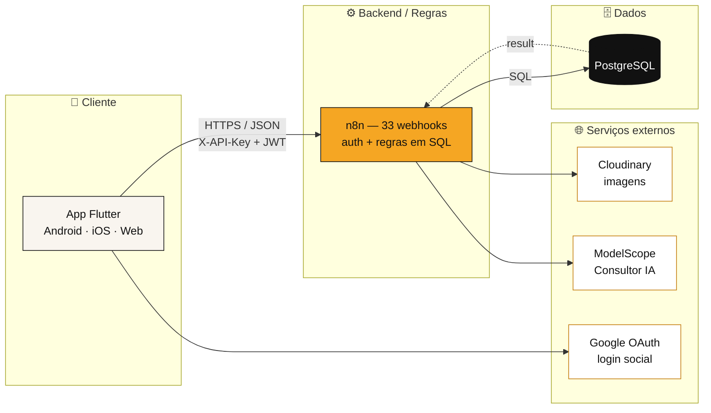
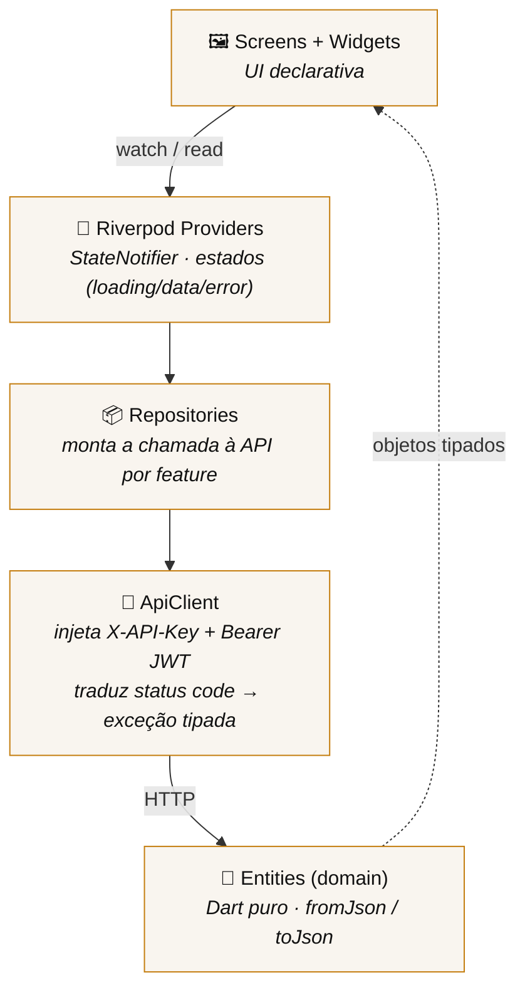
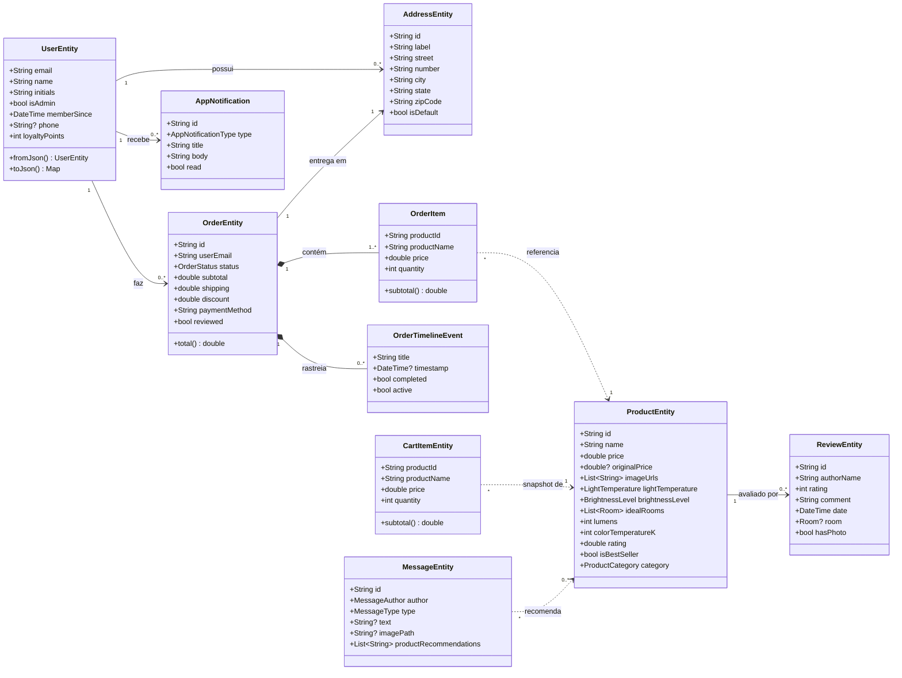
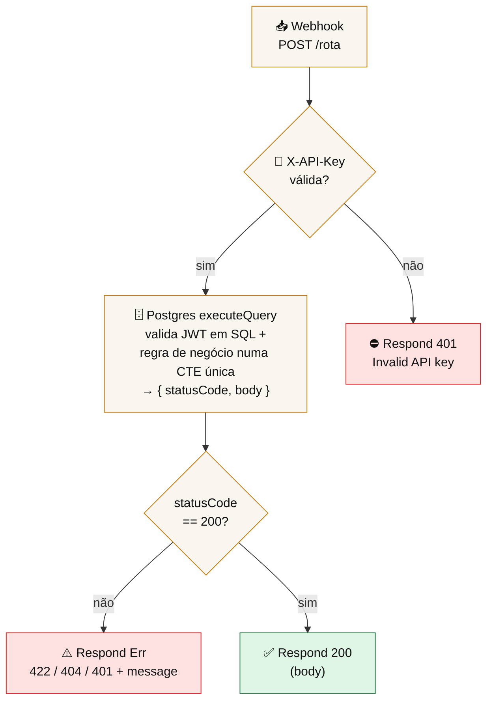
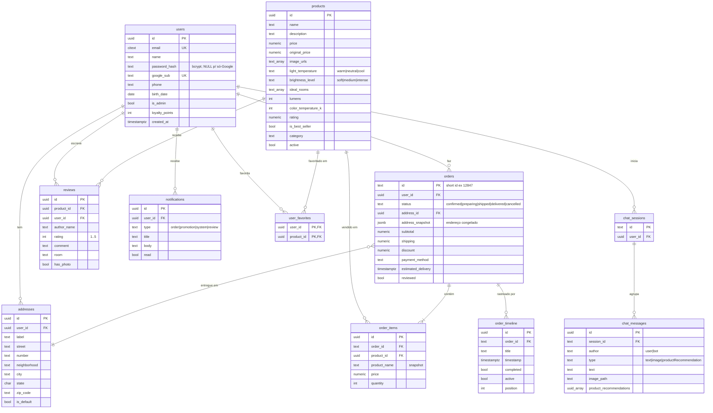
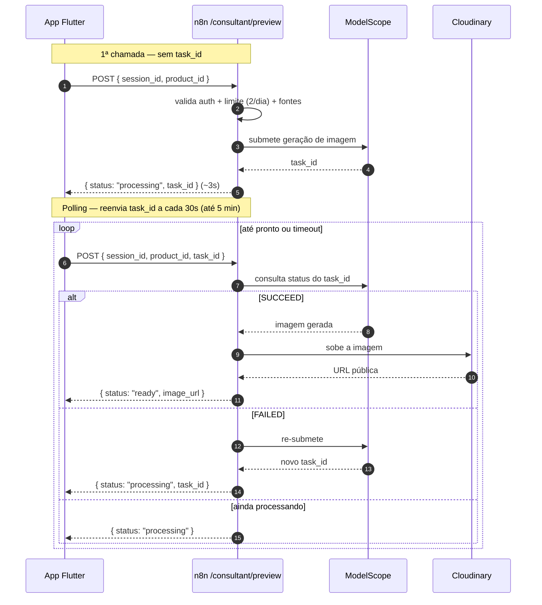
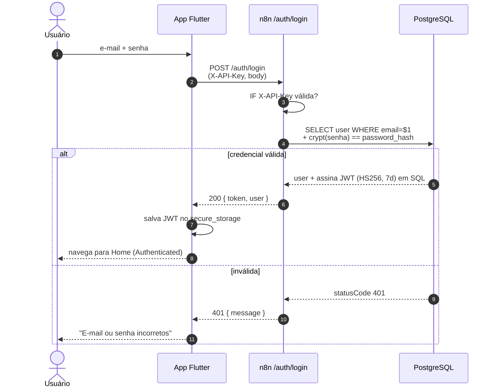
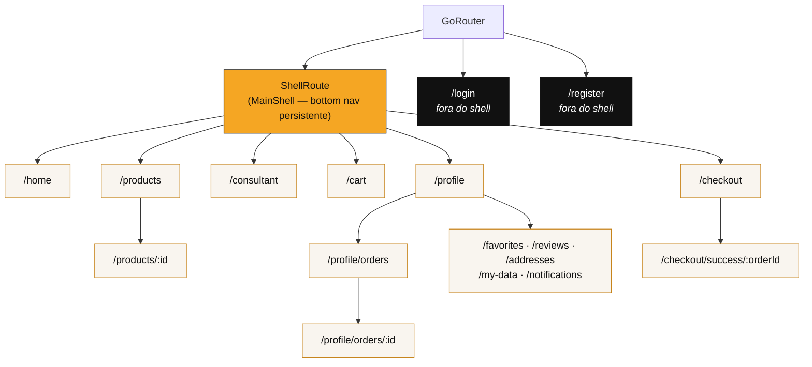

# Raitõ Corp — Mobile E-commerce

> Loja de iluminação em **Flutter**, com backend **100% em n8n + Postgres** e um
> **Consultor de Iluminação por IA** (chat, recomendação por foto e preview do
> produto no seu ambiente).
>
> 🎓 **Trabalho de Conclusão de Curso (TCC).** Projeto acadêmico que demonstra um
> e-commerce mobile completo, ponta a ponta — do design de interface à
> arquitetura de backend e à integração com modelos de IA generativa.



O app **nunca** fala direto com o banco: toda leitura e escrita passa por
webhooks n8n, que concentram autenticação e regras de negócio sobre o Postgres.

---

## Índice

1. [Visão geral](#visão-geral)
2. [Arquitetura em uma olhada](#arquitetura-em-uma-olhada)
3. [Stack e dependências](#stack-e-dependências)
4. [Arquitetura do app (Flutter)](#arquitetura-do-app-flutter)
5. [Backend (n8n + Postgres)](#backend-n8n--postgres)
6. [Banco de dados (PostgreSQL)](#banco-de-dados-postgresql)
7. [Consultor de Iluminação por IA](#consultor-de-iluminação-por-ia)
8. [Design system](#design-system)
9. [Funcionalidades](#funcionalidades)
10. [Autenticação](#autenticação)
11. [Navegação](#navegação)
12. [Persistência local](#persistência-local)
13. [Integrações externas](#integrações-externas)
14. [Estrutura de pastas](#estrutura-de-pastas)
15. [Como rodar](#como-rodar)
16. [Decisões técnicas](#decisões-técnicas)

---

## Visão geral

A Raitõ Corp é uma loja especializada em iluminação. O app cobre o ciclo completo
de compra e ainda traz um diferencial de IA. Capacidades:

- **Catálogo** com busca textual e filtro por ambiente
- **Carrinho persistente** (sobrevive a reloads e ao fluxo de login)
- **Checkout** com seleção de endereço, método de pagamento e descontos — gera um
  **pedido real** no backend
- **Pedidos** com timeline de status, cancelamento e **notificação local** quando
  o pedido sai para entrega / é entregue
- **Perfil completo:** dados, endereços, favoritos, avaliações (com foto),
  notificações e pontos de fidelidade
- **Login** email/senha e Google Sign-In
- **Painel administrativo:** avançar status de pedidos e CRUD de produtos com
  upload de imagem
- **Consultor IA:** chat, recomendação a partir de uma foto do ambiente e preview
  "como o produto fica no seu cômodo"
- **Auto-preenchimento de endereço por CEP**

> Status: **completo e em produção.** Os 33 workflows n8n estão ativos. Contrato
> da API em [`docs/N8N_API.md`](docs/N8N_API.md); estado do projeto em
> [`docs/HANDOFF.md`](docs/HANDOFF.md); documento de arquitetura para
> apresentação em [`docs/ARQUITETURA.md`](docs/ARQUITETURA.md).

### Usuários de teste

| Perfil | Login | Senha |
|---|---|---|
| Cliente | `teste@raito.com` | `teste1234` |
| Admin (vê o Painel Admin) | `admin@raito.com` | `admin1234` |

> Também dá pra criar conta nova pelo próprio app.

---

## Arquitetura em uma olhada

Três camadas independentes, conversando por HTTP:

| Camada | Tecnologia | Responsabilidade |
|---|---|---|
| **Cliente** | Flutter (Dart) | UI, estado, navegação, cache local |
| **Backend / regras** | n8n (low-code) | API gateway, autenticação, regras de negócio, orquestração de IA |
| **Dados** | PostgreSQL | Persistência (usuários, catálogo, pedidos, chat...) |
| **Serviços externos** | Cloudinary · ModelScope · Google OAuth | Imagens, IA do consultor, login social |

**Princípio central:** o app é "burro" de propósito — não conhece SQL nem
segredos de servidor. Ele só sabe falar com endpoints HTTP. Isso mantém a regra de
negócio num lugar só (n8n) e permite trocar/evoluir o backend sem republicar o app.

---

## Stack e dependências

### Flutter / Dart

| Pacote | Versão | Função | Por quê |
|---|---|---|---|
| `flutter_riverpod` | ^2.6.1 | State management | Declarativo, sem boilerplate de `ChangeNotifier`, `StateNotifier` + sealed class, sem `BuildContext` na lógica |
| `go_router` | ^14.6.2 | Navegação | `ShellRoute` (bottom nav persistente), deep links, query params para redirect de auth |
| `google_fonts` | ^6.2.1 | Tipografia | DM Serif Display + DM Sans via CDN |
| `phosphor_flutter` | ^2.1.0 | Ícones | Estilo editorial coerente, variações fill/regular/bold |
| `cached_network_image` | ^3.4.1 | Imagens de rede | Cache em disco, placeholder e error builder |
| `hive_flutter` | ^1.1.0 | Persistência local | NoSQL chave-valor rápido, sem FFI, roda na web |
| `shared_preferences` | ^2.3.3 | Preferências | Armazenamento simples de string |
| `flutter_secure_storage` | ^9.2.2 | Sessão (JWT) | Guarda o token no Keystore/Keychain |
| `flutter_local_notifications` | ^21.0.0 | Push local | Avisa no celular quando o pedido muda de status |
| `flutter_animate` | ^4.5.0 | Animações | DSL fluente, sem `AnimationController` manual |
| `shimmer` | ^3.0.0 | Loading skeleton | Efeito de carregamento padrão de mercado |
| `intl` | ^0.19.0 | Formatação | Locale `pt_BR` (moeda e datas) |
| `image_picker` | ^1.1.2 | Galeria/câmera | Foto de avaliação, de produto (admin) e do ambiente (consultor) |
| `gal` | ^2.3.2 | Salvar na galeria | Salvar o preview gerado pela IA |
| `google_sign_in` | ^6.2.1 | Login social | OAuth2 Google (Android, iOS, Web) |
| `http` | ^1.2.2 | Requisições HTTP | n8n, Cloudinary, ViaCEP/BrasilAPI |
| `equatable` | ^2.0.7 | Igualdade de entidades | Evita `==` manual no domínio |

### Backend e serviços externos

| Serviço | Uso |
|---|---|
| **n8n** (`n8n.raitocorp.com.br`) | API gateway + regras de negócio. Auth (bcrypt + JWT HS256) feita **em SQL** via `pgcrypto`. |
| **PostgreSQL** | Banco (users, products, orders, reviews, chat...). Acessado só pelo n8n. |
| **Cloudinary** | Upload de imagens (produtos, avaliações, fotos do ambiente, previews). |
| **ModelScope** (Alibaba) | Modelos do Consultor IA: Qwen2.5-72B (chat), Qwen2.5-VL-72B (visão), Qwen-Image-Edit (preview). |
| **Google Cloud OAuth 2.0** | Login social + People API (fallback de nome/email no web). |

---

## Arquitetura do app (Flutter)

### Feature-first + Clean Architecture simplificada

Cada feature encapsula suas próprias camadas:

```
lib/features/<feature>/
  data/
    *_repository.dart   ← acesso à API n8n via ApiClient
  domain/
    entities/           ← modelos puros (sem Flutter), com fromJson/toJson
  presentation/
    providers/          ← estado Riverpod (StateNotifier / Provider)
    screens/            ← páginas completas
    widgets/            ← widgets reutilizáveis da feature
```

**Por que feature-first e não layer-first?** Organizar por camada
(`models/`, `screens/`, `providers/`) espalha uma única feature por várias pastas.
Com feature-first, tudo de `orders` fica junto — facilita deleção, refatoração e
onboarding.

### Fluxo de dados (de cima a baixo)



O `ApiClient` central (`lib/core/api/`) é o único ponto que monta requisições:
injeta a `X-API-Key` e o `Bearer <JWT>`, e converte respostas de erro em exceções
tipadas (`ValidationException`, `AuthException`...). A UI nunca vê HTTP cru.

### Diagrama de classes — modelo de domínio

As entidades em `lib/features/*/domain/entities/` são objetos Dart puros (sem
dependência de Flutter), todas com `fromJson`/`toJson` para serialização contra a
API n8n. Relações principais:



> `*--` (composição) = o filho não existe sem o pai (um `OrderItem` só faz sentido
> dentro de um `OrderEntity`). `..>` (dependência) = referência fraca por id
> (o `CartItemEntity` guarda um *snapshot* do produto, não o objeto inteiro).

### Enums do domínio

```mermaid
classDiagram
    direction TB
    class LightTemperature { warm; neutral; cool }
    class BrightnessLevel { soft; medium; intense }
    class Room { bedroom; living; kitchen; bathroom; external; office; diningRoom }
    class ProductCategory { pendant; lamp; wallLamp; spot; strip; floorLamp; smart }
    class OrderStatus { confirmed; preparing; shipped; delivered; cancelled }
    class AppNotificationType { order; promotion; system; review }
    class MessageAuthor { user; bot }
    class MessageType { text; image; productRecommendation }
```



---

## Backend (n8n + Postgres)

O n8n hospeda **33 workflows**, um por endpoint. Todos seguem a mesma topologia —
entender um é entender todos:



**A autenticação roda dentro do SQL.** A instância n8n é *hardened* e bloqueia
`require('crypto')` e `$env` em nós Code. Então a verificação de senha (bcrypt) e
a validação do JWT HS256 (recalcular o HMAC-SHA256, decodificar o payload
base64url, checar `exp`) são feitas **inteiramente em PostgreSQL** via a extensão
`pgcrypto`. Não há nó Code para auth.

> O contrato completo dos 33 endpoints, com os IDs reais dos workflows, está em
> [`docs/N8N_API.md`](docs/N8N_API.md). A explicação detalhada da arquitetura
> (para a apresentação) está em [`docs/ARQUITETURA.md`](docs/ARQUITETURA.md).

---

## Banco de dados (PostgreSQL)

O Postgres é a única fonte de verdade dos dados. **Apenas o n8n acessa o banco** —
o app nunca recebe uma linha crua nem conhece SQL. Extensions usadas:
`pgcrypto` (UUID v4 + bcrypt via `crypt()`) e `citext` (e-mail case-insensitive).

### Diagrama Entidade-Relacionamento (ER)



> **Notação:** `||` um · `o{` zero-ou-muitos · `|{` um-ou-muitos. `PK` chave
> primária, `FK` estrangeira, `UK` única.

### Papel de cada tabela

| Tabela | Guarda | Observações de modelagem |
|---|---|---|
| `users` | Conta, perfil e pontos | `password_hash` é bcrypt (`pgcrypto`); `NULL` em contas só-Google. `email` é `citext` (case-insensitive). |
| `addresses` | Endereços do usuário | Um marcado `is_default`. Auto-preenchidos por CEP no app. |
| `products` | Catálogo | Arrays nativos do Postgres (`image_urls`, `ideal_rooms`, `tags`). `active=false` esconde sem deletar. |
| `reviews` | Avaliações de produto | `rating` com `CHECK (1..5)`. `user_id` vira `NULL` se a conta for removida (preserva histórico). |
| `orders` | Pedido | `id` é short id legível. **`address_snapshot` (JSONB)** congela o endereço no momento da compra — se o usuário editar/apagar o endereço depois, o pedido antigo não muda. |
| `order_items` | Linhas do pedido | `product_name`/`price` são **snapshot** — preço histórico não muda quando o catálogo muda. |
| `order_timeline` | Status passo a passo | Ordenado por `position`; alimenta a timeline vertical da tela de detalhe. |
| `user_favorites` | Relação N:N user↔produto | PK composta evita duplicata; toggle é `INSERT ... ON CONFLICT DO DELETE`. |
| `notifications` | Avisos do usuário | `read` controla o badge do sino. |
| `chat_sessions` | Conversa do consultor | `id` gerado pelo app (Hive) e reusado entre aberturas. |
| `chat_messages` | Turnos do chat | `product_recommendations` é array de UUIDs de produtos sugeridos pela IA. |

> O schema `CREATE TABLE` completo (com índices e tipos exatos) está na §2 de
> [`docs/N8N_API.md`](docs/N8N_API.md).

### Por que *snapshots* (denormalização proposital)?

`orders.address_snapshot` e `order_items.product_name/price/image_url` duplicam
dados que já existem em `addresses`/`products`. **É intencional:** um pedido é um
documento histórico. Se o produto mudar de preço ou o endereço for apagado, a nota
do pedido precisa continuar mostrando o que foi realmente comprado e para onde foi
enviado. Normalizar quebraria essa garantia.

---

## Consultor de Iluminação por IA

Diferencial do projeto. É um assistente que só fala de iluminação, com três
modos — todos servidos pela **ModelScope** (um único token, sem cota apertada de
provedor):

| Modo | Endpoint | Modelo | O que faz |
|---|---|---|---|
| **Chat** | `POST /consultant/message` | `Qwen2.5-72B-Instruct` | Conversa por texto; recomenda produtos do catálogo usando `lumens`, `color_temperature_k`, `ideal_rooms`. Guardrail por prompt de sistema. |
| **Foto** | `POST /consultant/image` | `Qwen2.5-VL-72B-Instruct` | Recebe uma foto do ambiente (+ texto opcional), classifica o cômodo/temperatura/intensidade e recomenda os **top 3** produtos. |
| **Preview** | `POST /consultant/preview` | `Qwen-Image-Edit-2509` | Gera uma imagem do **produto instalado no seu cômodo**, com a luz dele. Limite de 2/dia por usuário. |

### Preview assíncrono com polling

A geração de imagem leva 2-4 minutos, mas o Cloudflare na frente do n8n corta
conexões síncronas em ~100s (erro 524). A solução é um fluxo assíncrono no mesmo
endpoint, decidido por um `IF "Tem task_id?"`:



O `session_id` é persistido no app (Hive), então um preview que terminou com o app
fechado aparece ao reabrir o consultor (o servidor sempre salva o resultado no
banco, independente do polling em memória).

> Aprendizado registrado: nós langchain **somem** no import via SDK desta
> instância, e o free tier do Gemini é de apenas 20 req/dia. Por isso a IA inteira
> roda via **HTTP Request → ModelScope**, não via nós de IA nativos.

---

## Design system

Tokens centralizados em `lib/core/theme/`.

### Cores — `AppColors`

| Token | Hex | Uso |
|---|---|---|
| `obsidian` | `#111111` | Texto primário, botões, cards escuros |
| `cream` | `#F9F5EF` | Background geral (referência editorial, papel kraft) |
| `warmWhite` | `#FFFFFF` | Fundo de cards e sheets |
| `amber400` | `#F5A623` | Acento principal — a luz quente da marca |
| `amber600` | `#C47D0E` | Texto amber sobre fundo claro (contraste WCAG AA) |
| `success` | `#2D7A4F` | Confirmações, frete grátis, CEP encontrado |
| `error` | `#DC2626` | Erros e cancelamentos |
| `warmLight` / `coolLight` | `#F5A623` / `#A8C8E8` | Barra de temperatura de cor dos produtos |

**Por que âmbar?** A Raitõ vende iluminação. Âmbar é a cor da luz quente — o acento
reforça a marca em cada tela.

### Tipografia — `AppTypography`

- **Títulos / display:** DM Serif Display (serifada, editorial)
- **Corpo / UI:** DM Sans (sans-serif geométrica, legível em tamanhos pequenos)

Mesma família de design (DM) → harmonia sem conflito tipográfico.

### Espaçamento e bordas

```
AppSpacing  xs=4  sm=8  md=12  lg=16  xl=20  xxl=24  xxxl=32  huge=48  page=20
AppRadius   sm=8  md=12  lg=16  xl=20  full=999
```

`page` (20) é o padding horizontal padrão de todas as telas.

---

## Funcionalidades

<details>
<summary><strong>Home · Catálogo · Detalhe do produto</strong></summary>

- **Home:** banner hero, "Mais vendidos", categorias por ambiente, banner do
  Consultor IA, avatar com iniciais no AppBar.
- **Catálogo:** lista de `ProductCard`, busca textual em tempo real, filtro por
  ambiente (chips), contagem de resultados. Cada card: imagem cacheada, preço (com
  tachado em desconto), barra de temperatura de cor, tags, badge "Mais vendido",
  favoritar (requer login) e adicionar ao carrinho.
- **Detalhe:** galeria, especificações técnicas (W, lúmens, K, dimensões, peso),
  certificações, garantia, economia de energia, avaliações (com foto) e ambientes
  ideais.
</details>

<details>
<summary><strong>Carrinho · Checkout · Sucesso</strong></summary>

- **Carrinho:** itens com controle de quantidade, remover individual e limpar
  tudo, resumo (subtotal, frete, total). **Persistido em Hive** — sobrevive a hot
  restart, login e fechamento do app. **Auth guard:** finalizar sem login abre
  bottom sheet de login/cadastro preservando o carrinho.
- **Checkout:** seleção de endereço (com picker), método de pagamento — **Pix**
  (5% de desconto), **cartão** (até 10x), **boleto** — e resumo financeiro. Ao
  confirmar, cria um **pedido real** via `POST /me/orders`.
- **Sucesso:** animação de check, data estimada de entrega, atalhos para acompanhar
  o pedido ou voltar ao início.
</details>

<details>
<summary><strong>Perfil · Pedidos · Endereços · Favoritos · Avaliações · Notificações</strong></summary>

- **Perfil (hub):** card de identidade (avatar de iniciais, badge Admin quando
  aplicável), card de pedido ativo com anel pulsante, menu com contadores, barra de
  pontos de fidelidade, sino com badge de não lidas.
- **Pedidos:** lista com filtros por status, timeline vertical no detalhe,
  cancelamento e "avaliar pedido" (entregues). **Notificação local** dispara quando
  o status vira *shipped* / *delivered*.
- **Endereços:** lista com default destacado, definir padrão / excluir,
  auto-preenchimento por CEP.
- **Favoritos / Avaliações / Notificações:** grid de favoritos; abas
  "para avaliar / avaliados"; notificações agrupadas por período, swipe para
  deletar, "marcar todas como lidas".
</details>

<details>
<summary><strong>Painel Admin</strong> (só para <code>is_admin</code>)</summary>

- Avançar status de pedidos (confirmed → preparing → shipped → delivered).
- CRUD de produtos com upload de imagem (Cloudinary). A validação de `is_admin`
  acontece **no SQL** de cada workflow admin — não dá pra burlar pelo app.
</details>

---

## Autenticação

```dart
sealed class AuthState {
  AuthLoading                       // carregando token do storage
  Unauthenticated(errorMessage?)
  Authenticated(user)
}
```

**Por que sealed class?** O `switch` é exaustivo em tempo de compilação —
impossível esquecer de tratar o loading ou o erro.

### Sequência — login email/senha



- **Email/senha:** `POST /auth/login` valida a senha (bcrypt via `pgcrypto`) e
  devolve um JWT HS256 (TTL 7 dias). O token vai pro `flutter_secure_storage`; a
  sessão é reidratada via `GET /me` na inicialização.
- **Google Sign-In:** `POST /auth/google` troca o `id_token` do Google por um JWT
  Raitõ. No web, como o `google_sign_in_web` não popula `email`/`name`, o app busca
  esses dados na **People API** com o `access_token`.
- **Auth guard no checkout:** finalizar sem login abre o sheet de login; o redirect
  é preservado (`/login?redirect=/checkout`) e o carrinho nunca é perdido.

> **Por que não Firebase Auth?** A identidade é própria (n8n + JWT).
> `firebase_core` + `firebase_auth` somariam ~2 MB ao bundle e duplicariam uma
> camada que já existe no backend. O `google_sign_in` isolado cobre o OAuth2.

---

## Navegação

GoRouter com `ShellRoute` para bottom nav persistente:



- **Tudo com bottom nav fica dentro do shell**; só login/registro ficam fora
  (intencional — passa a sensação de "modo de autenticação").
- **Transições:** fade (220ms) entre tabs, slide (280ms) ao aprofundar.
- **`rootNavigator: true`** em todos os dialogs e loading modals — o `ShellRoute`
  tem um navigator interno, e sem isso o `pop` fecharia a página em vez do dialog.

---

## Persistência local

| O quê | Onde | Por quê |
|---|---|---|
| **Carrinho** | Hive (`Box<String>`, JSON) | Lista variável, escritas frequentes, roda na web sem FFI |
| **Sessão (JWT)** | `flutter_secure_storage` | Keystore/Keychain; reidratada via `GET /me` |
| **`session_id` do consultor** | Hive (`consultant_box`) | Retoma a mesma conversa entre aberturas |

---

## Integrações externas

### CEP — auto-preenchimento (`lib/core/services/cep_service.dart`)

```
8 dígitos → ViaCEP  ──(falha)──▶ BrasilAPI  →  logradouro/bairro/cidade/UF
                                              →  foca no campo "Número"
```

**Dois provedores** porque nenhuma API pública tem 100% de uptime, e ViaCEP +
BrasilAPI têm infra independente. Timeout de 6s por tentativa. UX: máscara
`XXXXX-XXX`, spinner inline, ✓/⚠ de status, dropdown com os 27 estados.

### Cloudinary — upload de imagens

Preset *unsigned* (`raitocorp-mobile`, cloud `dvt0gyhlr`). Usado para fotos de
produto (admin), de avaliação, do ambiente (consultor) e para o preview gerado
pela IA. Nada secreto — cloud name e preset são públicos por natureza.

---

## Estrutura de pastas

```
lib/
├── main.dart                        # Hive + intl + notificações + ProviderScope
├── app.dart                         # MaterialApp + tema + router
│
├── core/
│   ├── api/                         # ApiClient (X-API-Key + JWT), auth_storage, exceptions
│   ├── config/app_config.dart       # base URL, API key, Cloudinary (defaults de prod)
│   ├── upload/                      # CloudinaryService + seletor câmera/galeria
│   ├── notifications/               # notificações locais (status do pedido)
│   ├── router/app_router.dart       # GoRouter — toda a árvore de rotas
│   ├── services/cep_service.dart    # ViaCEP + BrasilAPI
│   ├── theme/                       # tokens de design
│   └── widgets/                     # widgets compartilhados (shell, nav, product card)
│
├── shared/
│   └── extensions/                  # formatCurrency() em pt_BR
│
└── features/
    ├── admin/        # hub admin: avançar pedidos + CRUD de produtos
    ├── auth/         # login, registro, Google Sign-In, AuthState sealed
    ├── cart/         # carrinho Hive, checkout, sucesso
    ├── consultant/   # Consultor IA: chat, foto, preview
    ├── home/         # home
    ├── products/     # catálogo, detalhe, filtros, busca
    └── profile/      # hub, pedidos, endereços, favoritos, avaliações, notificações, meus dados
```

Cada feature tem `data/`, `domain/` e `presentation/`.

---

## Como rodar

### Pré-requisitos

- Flutter SDK `^3.11.4`
- Android: SDK + Java 21 (para gerar APK). Web: Chrome/Edge.

### Instalação

```bash
git clone <repo>
cd raitocorp_mobile
flutter pub get
```

### Executar

O app já aponta para **produção por padrão** (base URL, API key e Cloudinary são
`defaultValue` em `lib/core/config/app_config.dart`), então `flutter run` puro já
funciona — sem `--dart-define`.

```bash
flutter run -d chrome --web-port=5000   # Web (porta fixa p/ Google Sign-In)
flutter run -d android                  # Android
flutter run -d ios                      # iOS
```

> **Atenção:** no **Chrome** os webhooks n8n dão erro de **CORS**
> (`No 'Access-Control-Allow-Origin'`). Para testar o backend de verdade, use
> **Android/emulador**, onde CORS não se aplica.

Para apontar para um n8n local/staging, sobrescreva via `--dart-define`
(`N8N_BASE_URL`, `N8N_API_KEY`, `N8N_WEBHOOK_PREFIX`).

### Gerar o APK (distribuição)

```bash
flutter build apk --release
# saída: build/app/outputs/flutter-apk/app-release.apk (~56 MB)
```

Assinado com debug key — instala em qualquer Android com "fontes desconhecidas"
habilitado. Nome do app: **RaitoCorp**.

---

## Decisões técnicas

**Riverpod (e não Bloc/Provider).** Bloc é robusto mas verboso (Event, State, Bloc,
BlocProvider, BlocBuilder por feature). `StateNotifier` + sealed class dá o mesmo
resultado com metade do código, e Riverpod não depende de `BuildContext` para
leitura — lógica de negócio separada da UI.

**GoRouter (e não Navigator 2.0 manual / AutoRoute).** É o router oficial do
Flutter; `ShellRoute` resolve a bottom nav persistente nativamente; AutoRoute
geraria código (passo de build + arquivos gerados no repo).

**Hive para o carrinho (e não SQLite).** Estrutura simples (lista de primitivos)
não justifica schema relacional, e Hive roda na web sem FFI (sqflite não roda na
web sem workaround).

**Backend em n8n (e não um backend tradicional).** Para um TCC, o n8n concentra
auth + regras + integrações de IA num lugar visual e versionável, sem precisar
manter um servidor de aplicação. O custo é conviver com as restrições da instância
*hardened* (auth em SQL, sem path param dinâmico, sem nós langchain via SDK) —
documentadas em [`docs/N8N_API.md`](docs/N8N_API.md) e [`docs/HANDOFF.md`](docs/HANDOFF.md).

**Consultor IA via ModelScope (e não Gemini/langchain).** Os nós langchain somem no
import via SDK desta instância, e o Gemini free tier é de 20 req/dia. ModelScope
serve chat, visão e edição de imagem com um único token e cota folgada. O preview é
assíncrono com polling porque o Cloudflare corta conexões longas em ~100s.

**Segurança "TCC".** JWT secret e API key estão hardcoded nos workflows, e o APK usa
debug-signing. Aceitável para a entrega; trocar antes de um deploy real.
